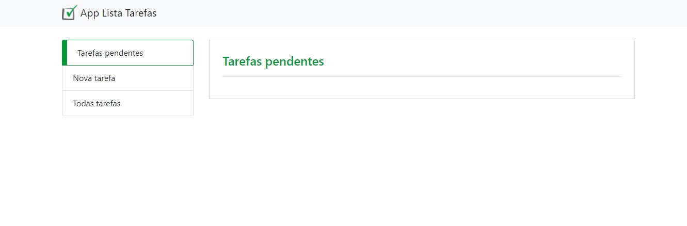
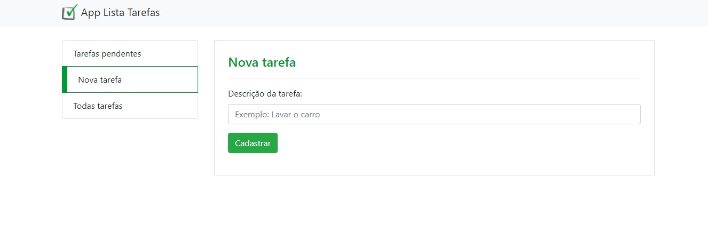
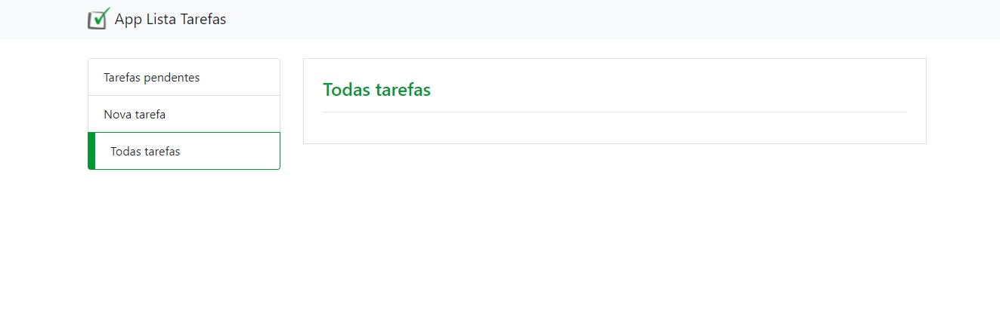

# app_lista_de_tarefas
Aplicativo Desenvolvido em PHP durante o Curso Desenvolvimento WEB Completo ministrado por Jorge Sant Ana

Obs.: Nesta aplicação é possível adcionar uma nova tarefa, editar as tarefas existentes e excluir. 
   Há também um banco de dados para registro das tarefas.

   
 
upload → para visualizar o site no ar acesse esse link:
 <a href="applistatarefa2.epizy.com">App lista de tarefa</a>

    <h4>Painel de todas as tarefas ainda pendentes</h4>
     

    <h4>Painel de registro das tarefas</h4>
     

    <h4>Painel de listagem de todas as tarefas realizadas e pendentes</h4>
     

